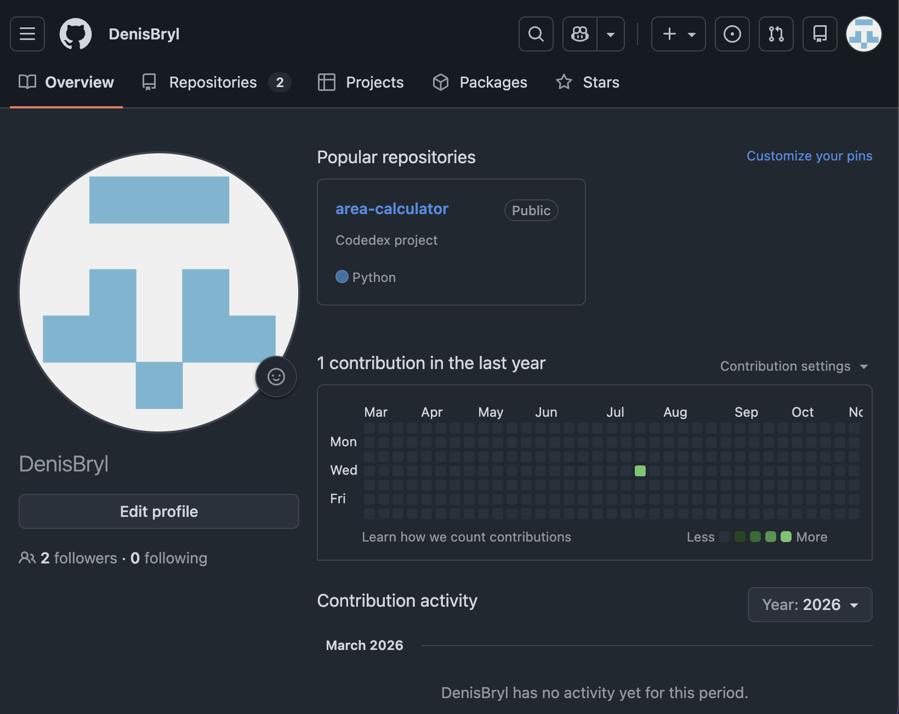
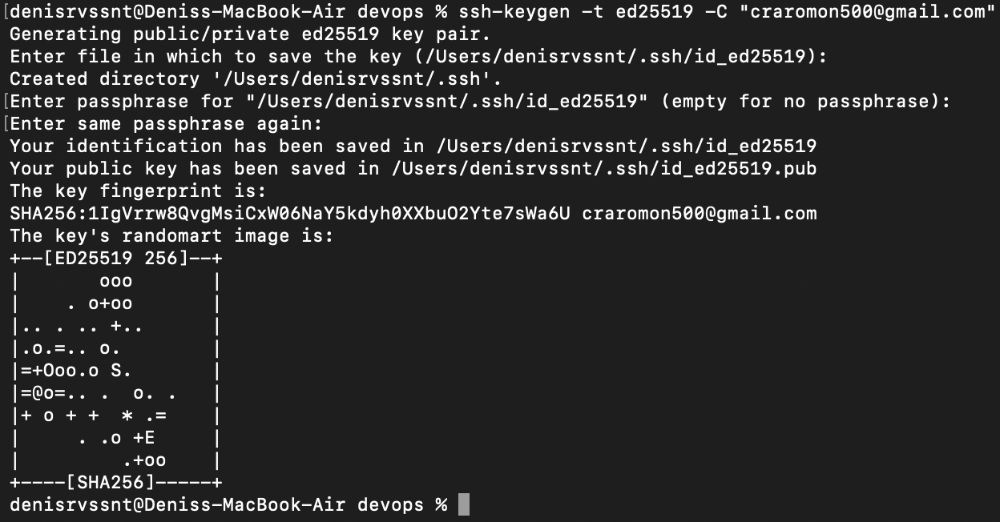
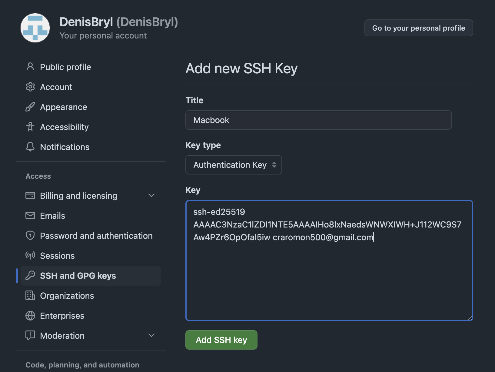
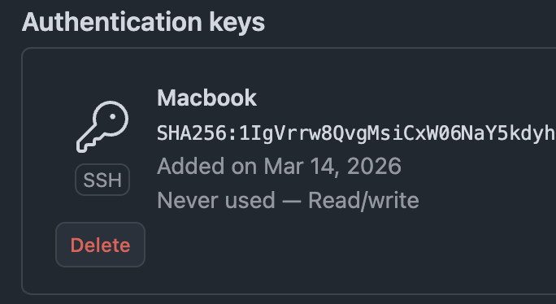
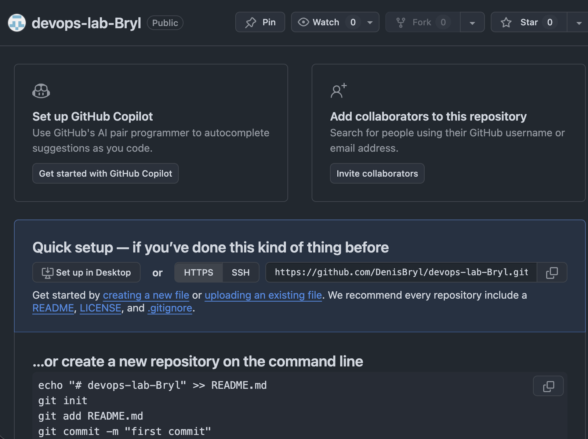
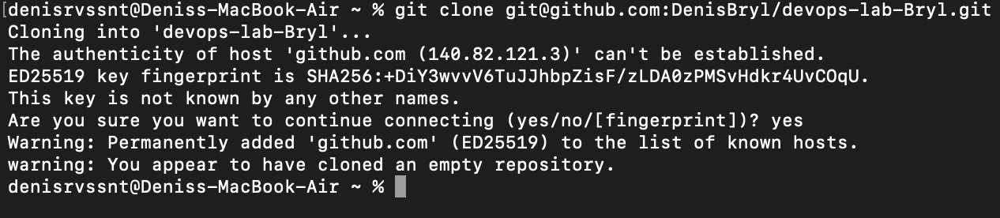
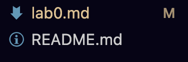
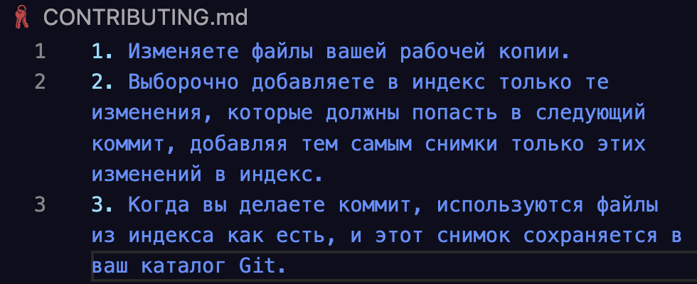
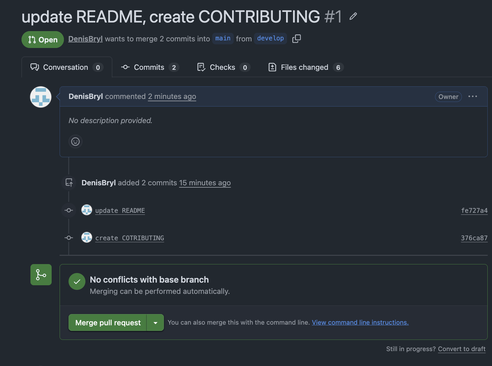
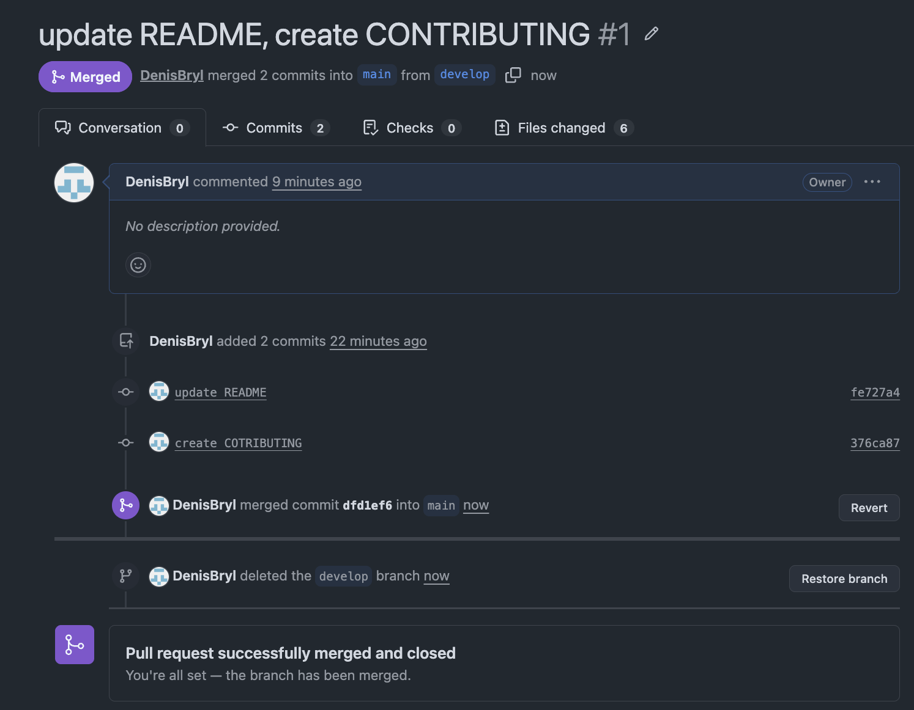

1. Ранее у меня был аккаунт в GitHub - перешел к нему. SSH ключа ранее не было - его создал и настроил.

2. Создал репозиторий devops-lab-Bryl.

3. Склонируйте созданный репозиторий себе на компьютер при помощи git clone.

4. Создал файл README.md. 

5. Создал файл .gitignore и включил в него стандартные исключения.

6. Создал ветку develop и переключился на нее.

7. Создал файл CONTRIBUTING.md с правилами участия в проекте. 

8. Поскольку мы коммитили на каждом этапе, нам не нужен initial commit.

9. Создал Pull Request из ветки develop в main с описанием внесенных изменений.

10.  Смержил Pull Request и удалил ветку.

