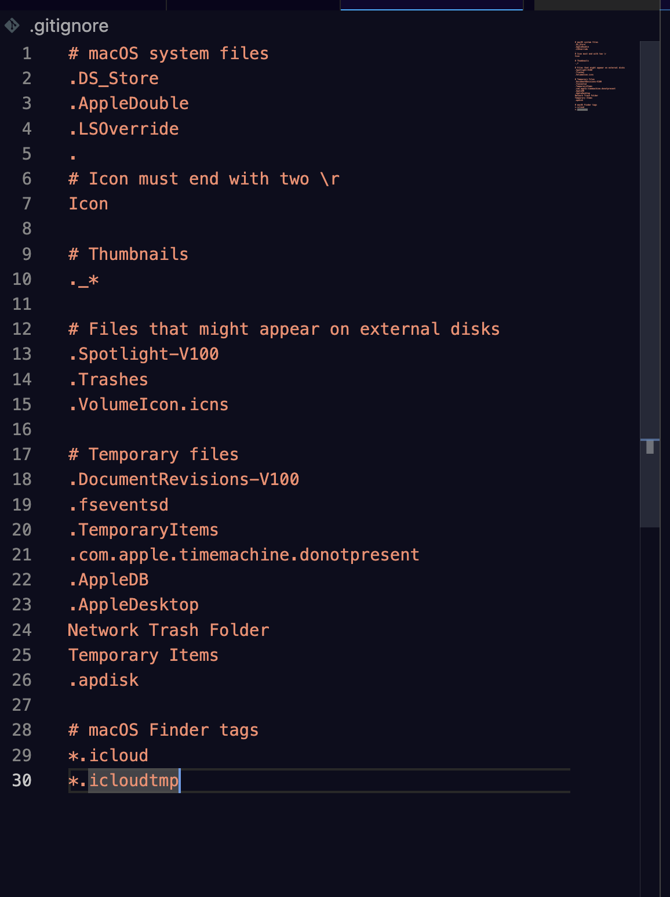
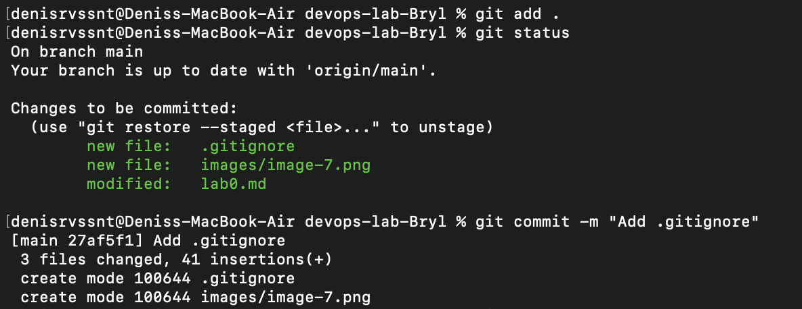
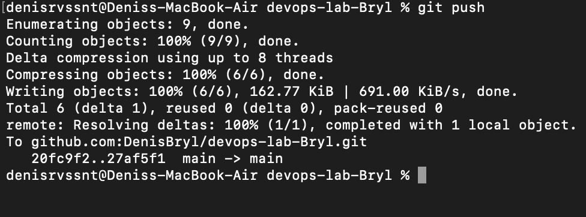
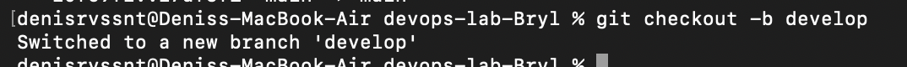

1. Ранее у меня был аккаунт в GitHub - перешел к нему. SSH ключа ранее не было - его создал и настроил.

2. Создал репозиторий devops-lab-Bryl.

3. Склонируйте созданный репозиторий себе на компьютер при помощи git clone.

4. Создал файл README.md с описанием проекта, вашими контактными данными и планом изучения DevOps. 

5. Создал файл .gitignore и включил в него стандартные исключения.

6. 

