### Установка Docker

1. Docker у меня был уже установлен

2. Проверил версию
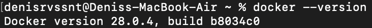

3. Запутил тестовый контейнер

4. Проверил базовые команды
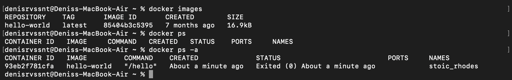

### Работа с готовыми образами

5. Скачал образ Ubuntu

6. Запустил интерактивный контейнер

7. Внутри контейнера установил пакет curl

8. Проверил установку curl
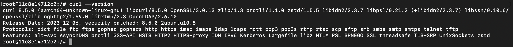

9. Вышел из контейнера 
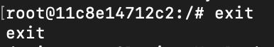

### Запуск веб-сервера

10. Запустил контейнер с nginx
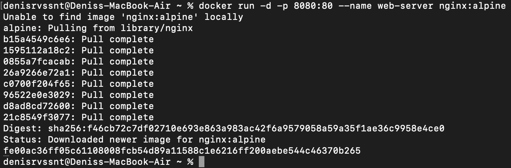

11. Проверил работу в браузере
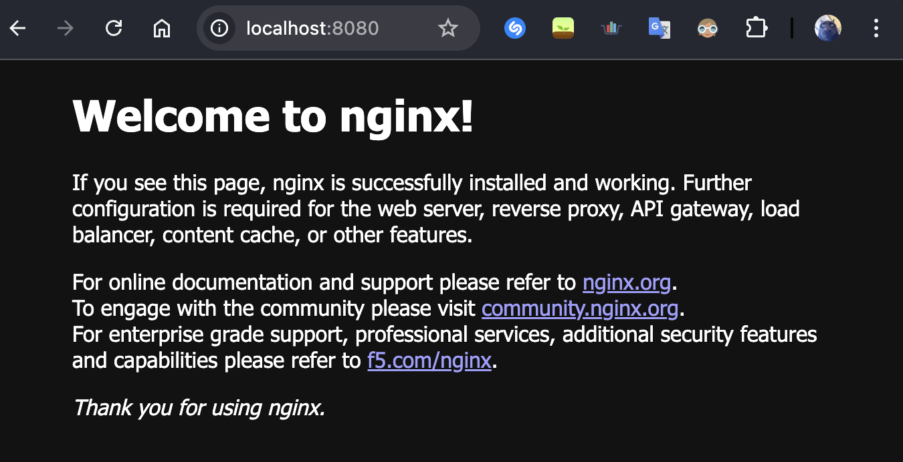

12. Посмотрел логи контейнера

13. Подключился к контейнеру

### Управление контейнерами
14. Посмотрел запущенные контейнеры
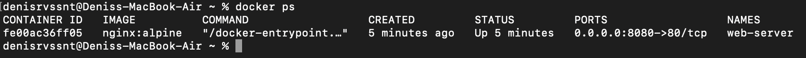

15. Посмотрел все контейнеры
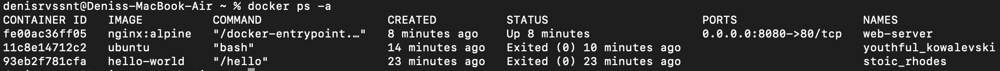

16. Остановил контейнер
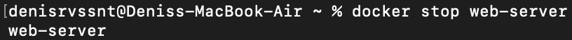

17. Запустил остановленный контейнер
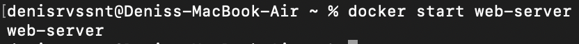

18. Удалил контейнер
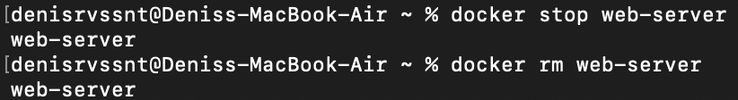

19. Удалил образ
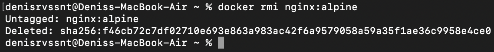

### Работа с томами (volumes)

20. Создал том
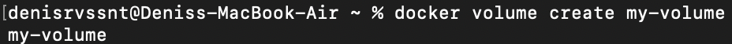

21. Запустил контейнер с томом

22. Подключился к контейнеру
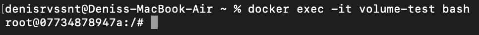

23. Создал файл в томе
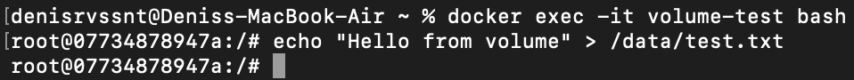

24. Удалил контейнер и создал новый с тем же томом
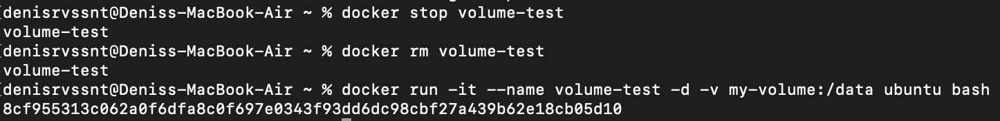

25. Проверил, что файл сохранился
