### Установка Docker

1. Docker у меня был уже установлен
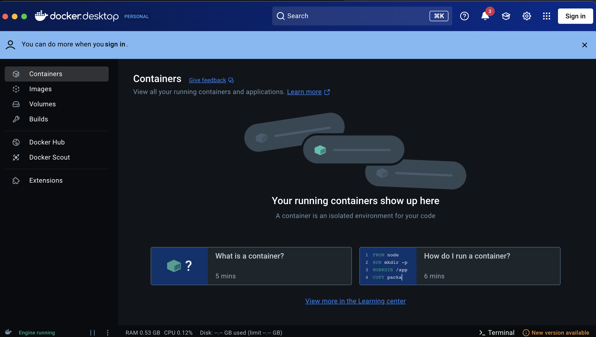

2. Проверил версию

3. Запутил тестовый контейнер
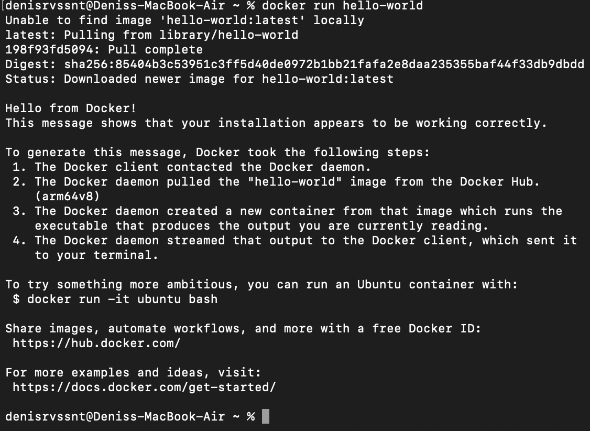

4. Проверил базовые команды

### Работа с готовыми образами

5. Скачал образ Ubuntu
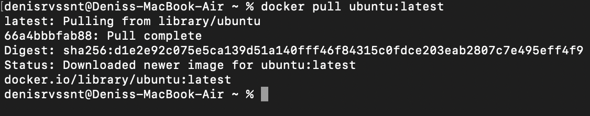

6. Запустил интерактивный контейнер
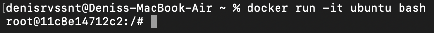

7. Внутри контейнера установил пакет curl
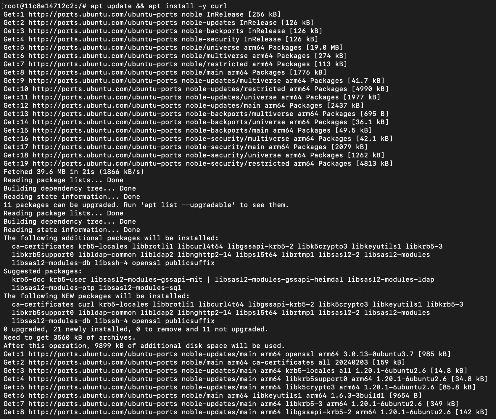

8. Проверил установку curl

9. Вышел из контейнера 

### Запуск веб-сервера

10. Запустил контейнер с nginx

11. Проверил работу в браузере

12. Посмотрел логи контейнера
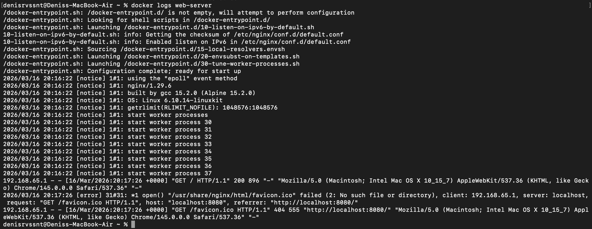

13. Подключился к контейнеру
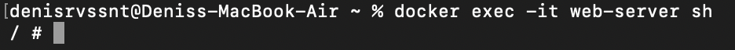

### Управление контейнерами
14. Посмотрел запущенные контейнеры

15. Посмотрел все контейнеры

16. Остановил контейнер

17. Запустил остановленный контейнер

18. Удалил контейнер

19. Удалил образ

### Работа с томами (volumes)

20. Создал том

21. Запустил контейнер с томом
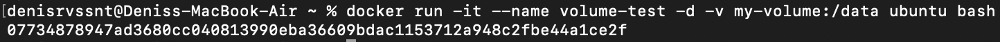

22. Подключился к контейнеру

23. Создал файл в томе

24. Удалил контейнер и создал новый с тем же томом

25. Проверил, что файл сохранился
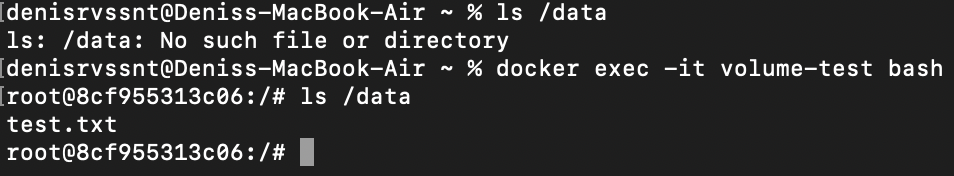

### Задача со звездочкой

26. Создал файлов проекта
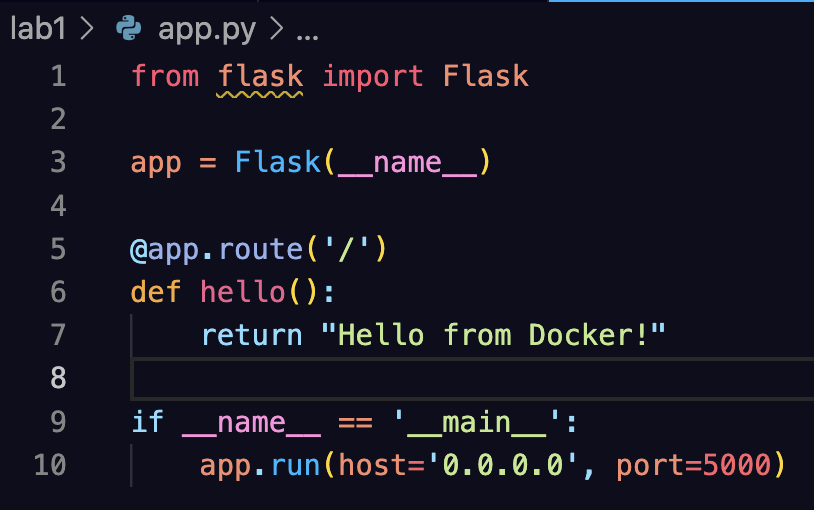

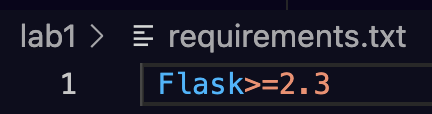

27. Создал Dockerfile
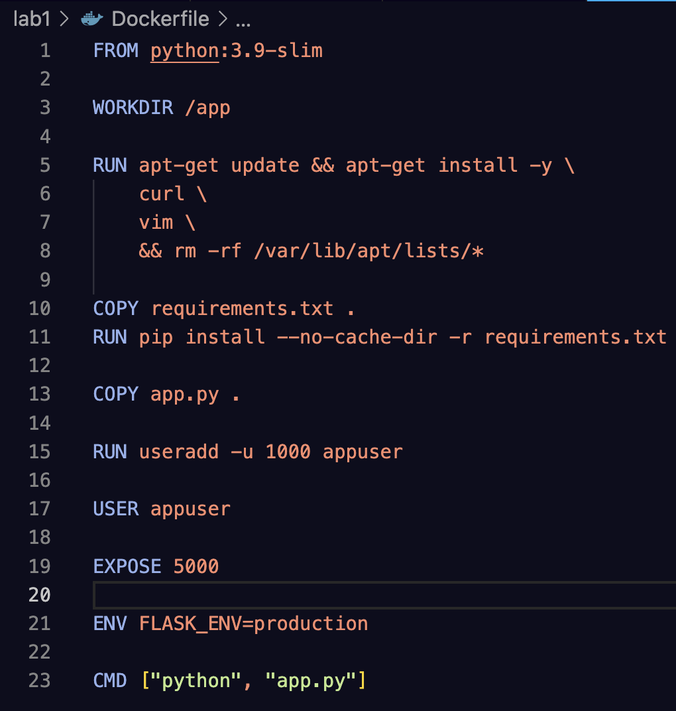

28. Проверка работы
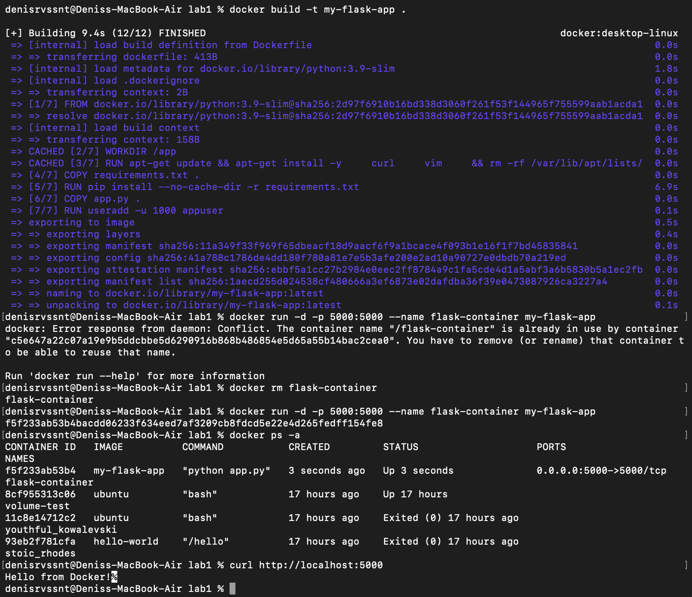
