## Подготовка проекта

1. Скопировал файлы из первой лабораторной в новый репозиторий
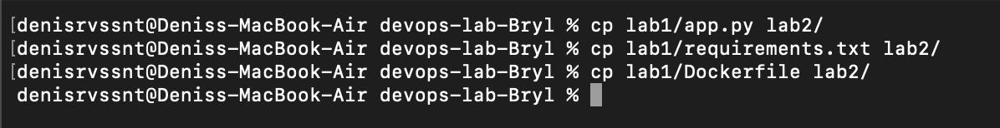

2. Вошел в аккаунт Docker Hub
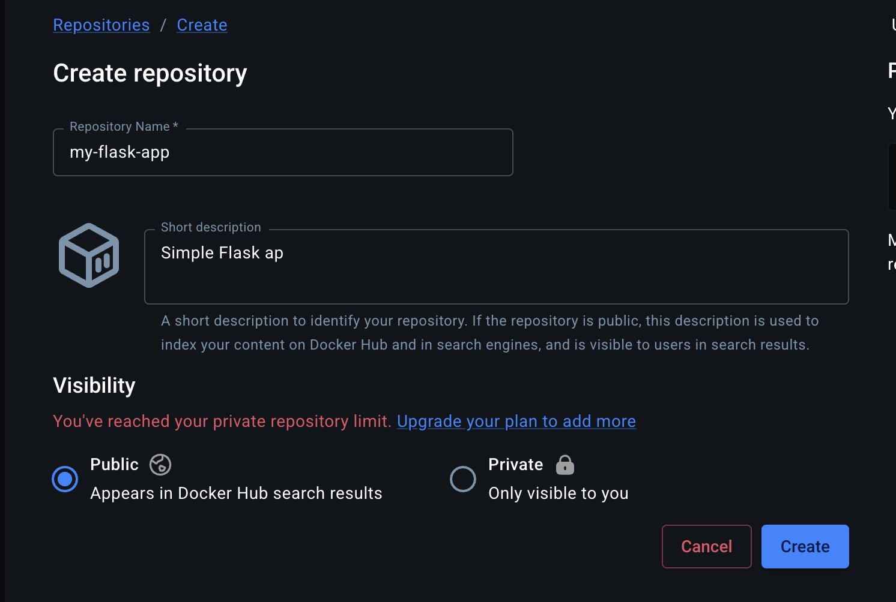

3. Создал новый репозиторий на Docker Hub для моего образа
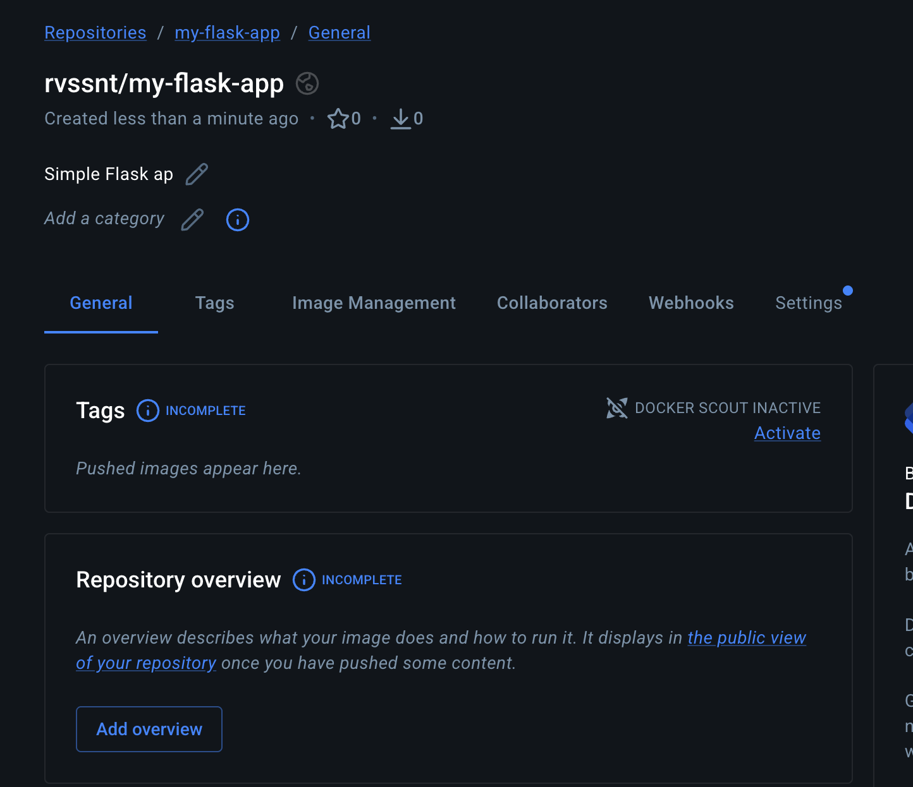

### Настройка GitHub Actions

4. Создал папку .github/workflows/ в корне проекта
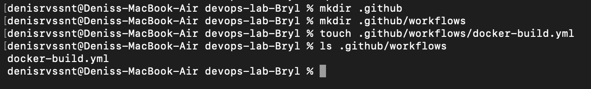

5. Создал файл docker-build.yml с пайплайном
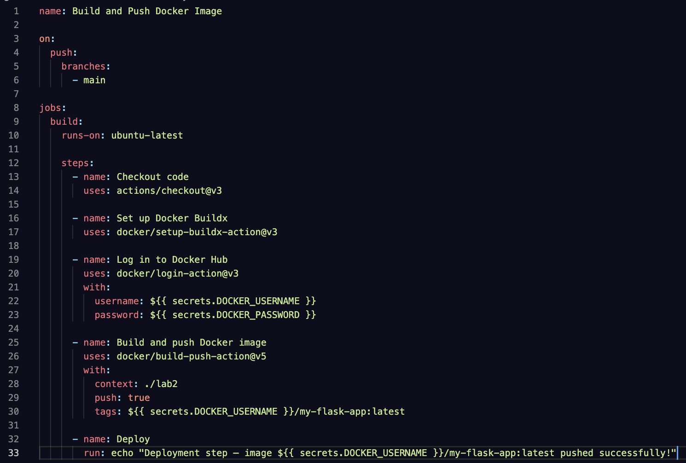

### Настройка секретов

6. Получил access-токен в Docker Hub
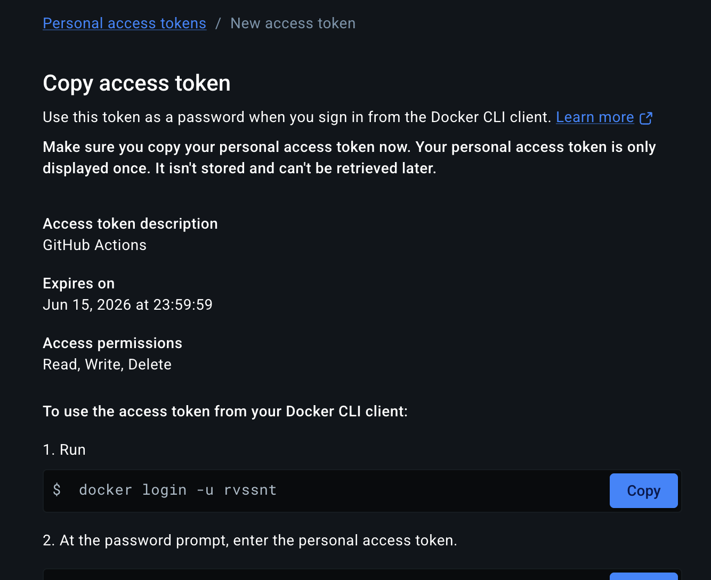

7. В настройках GitHub репозитория добавил секреты
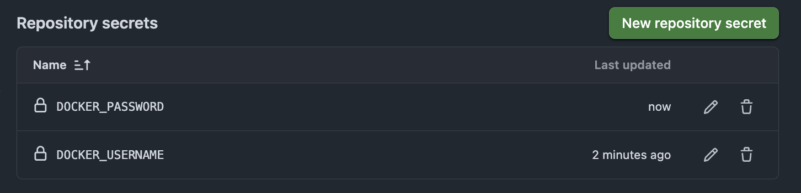

### Тестирование пайплайна

8. Запушил в репозиторий для проверки работы пайплайна
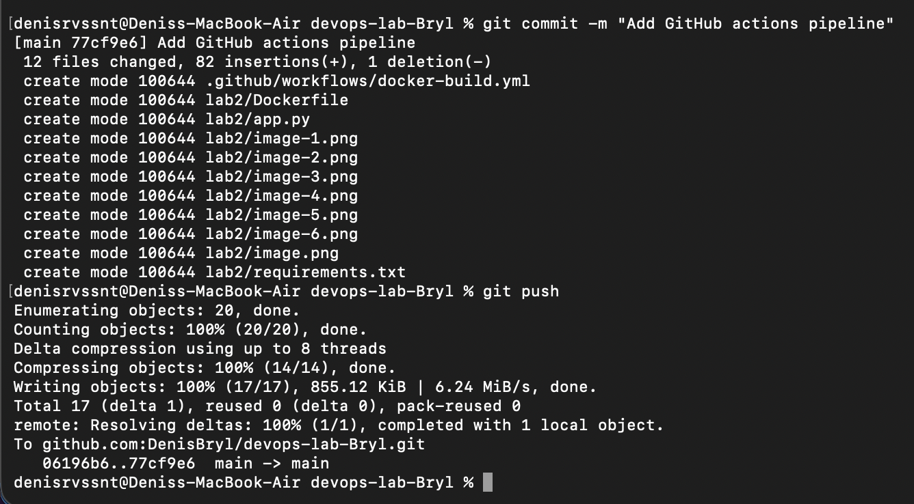

9. Созданный пайплайн в Github Actions:
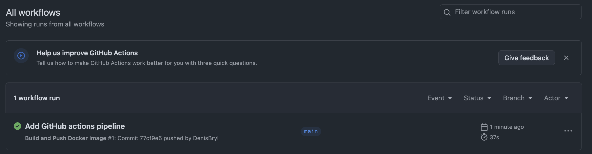

10. Все этапы пайплайна:
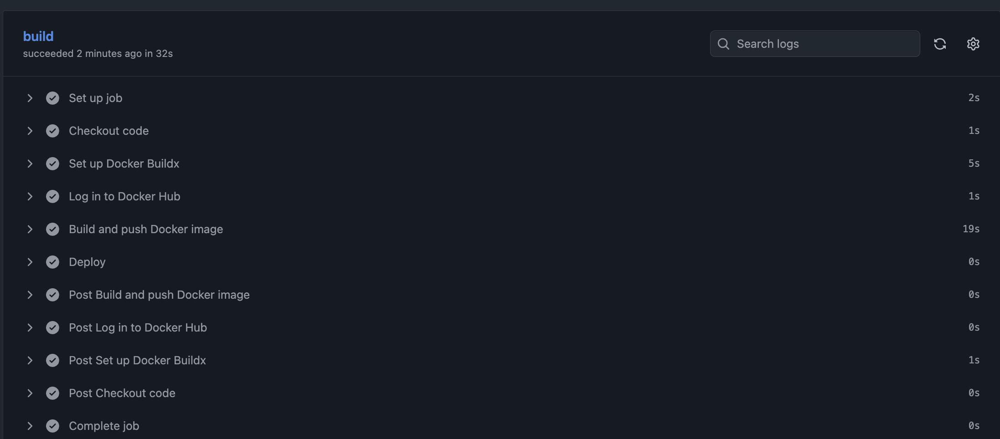

11. Созданный образ в Docker Hub:
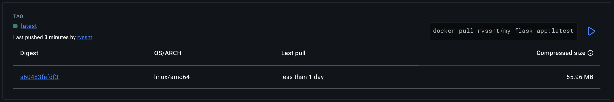