### Создание конфигурации Prometheus

1. Создал файл prometheus/prometheus.yml

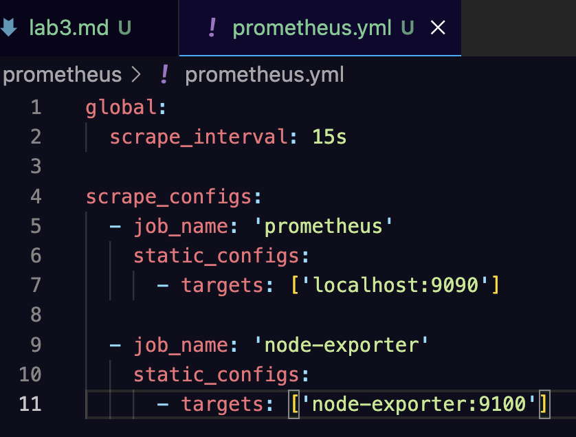

2. Создал тома и нетворк в докере

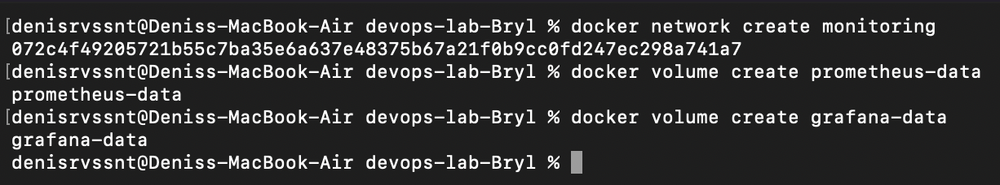

### Запуск Node Exporter
3. Запустил контейнер Node Exporter для сбора системных метрик

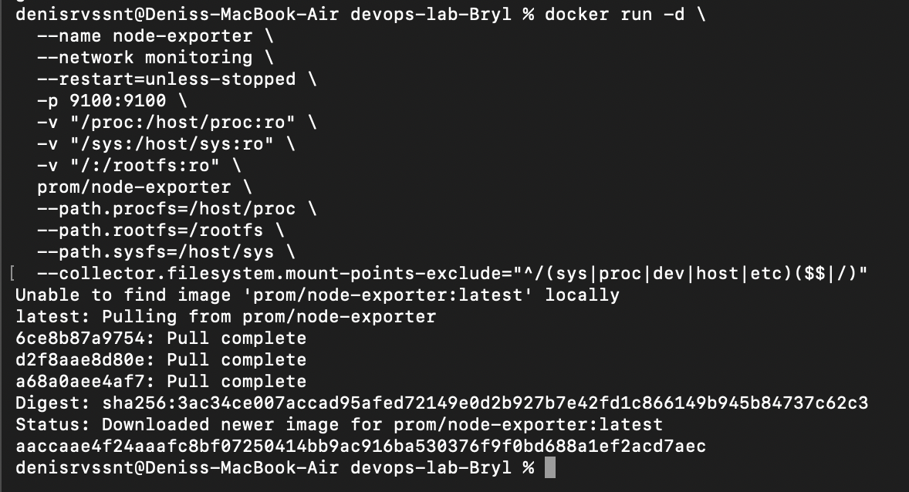

4. Проверил работу

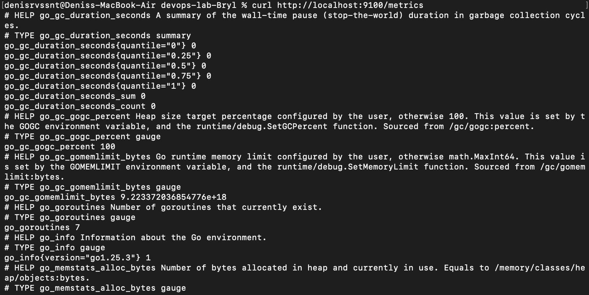
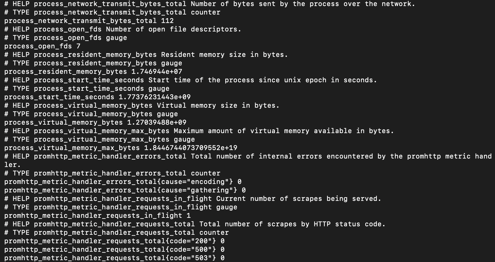

### Запуск Prometheus

5. Вышел на папку выше в консоли, убедился, что нахожусь над уровнем папки prometheus. Запустил контейнер Prometheus

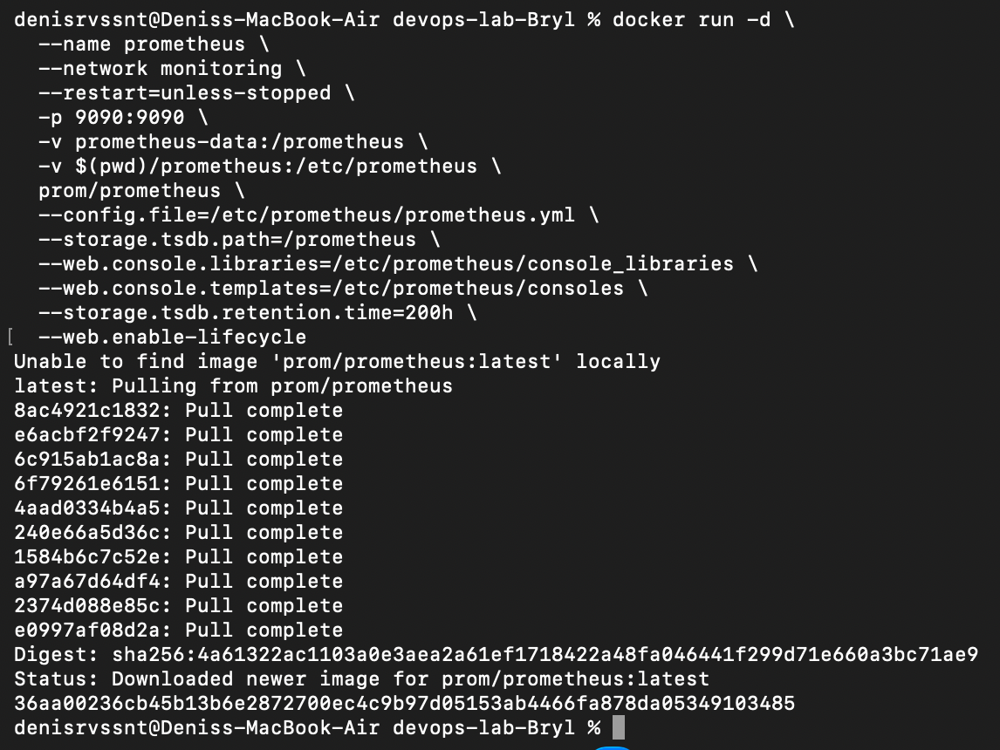

6. Проверил работу

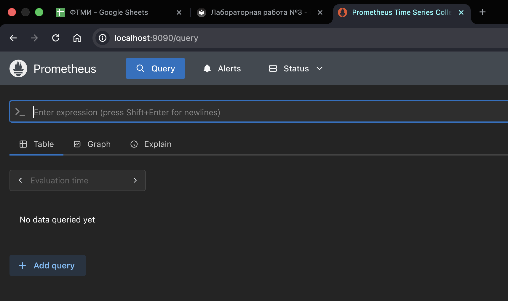

### Запуск Grafana

7. Запустил контейнер Grafana

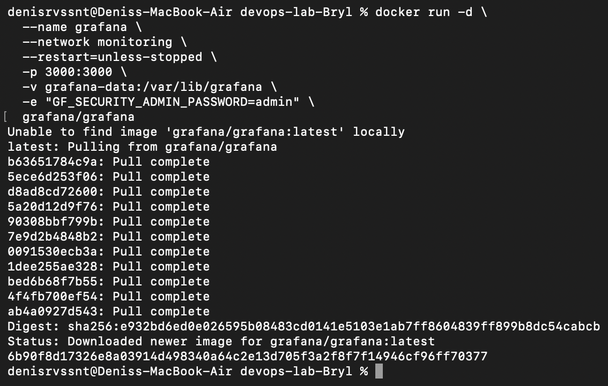

### Настройка Grafana

8. Вошел в Grafana

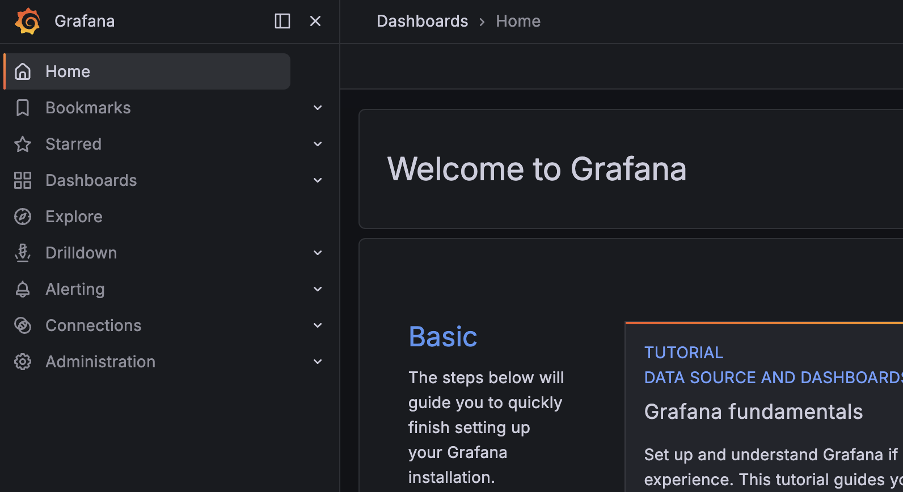

9. Добавил источник данных Prometheus

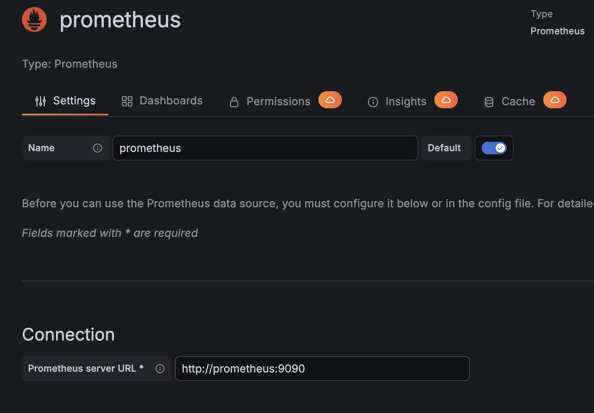
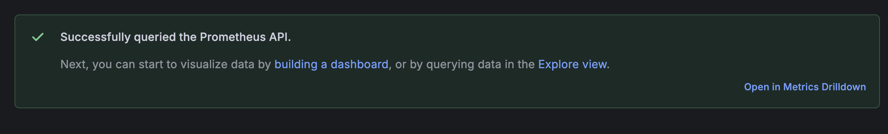

10. Создал дашборд

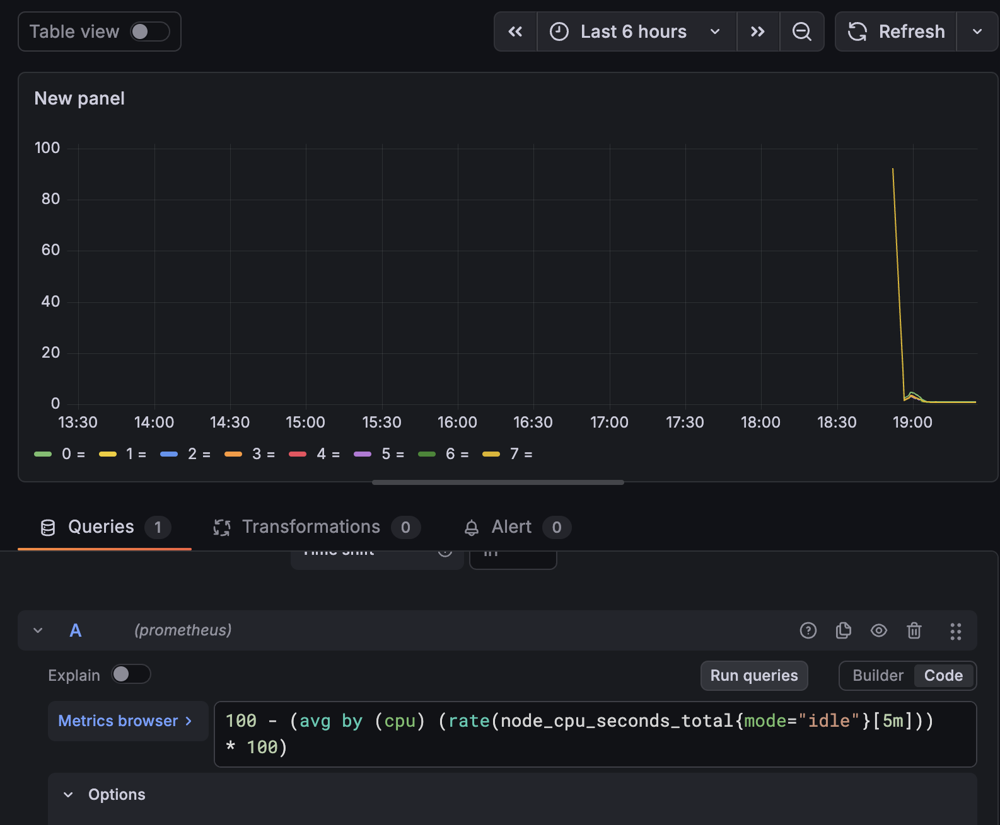
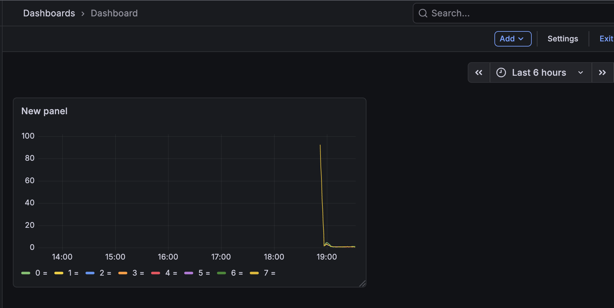

### Тестирование системы

11. Проверил все контейнеры системы

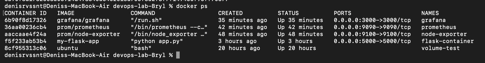

12. Открыл Prometheus и убедился, что метрики собираются

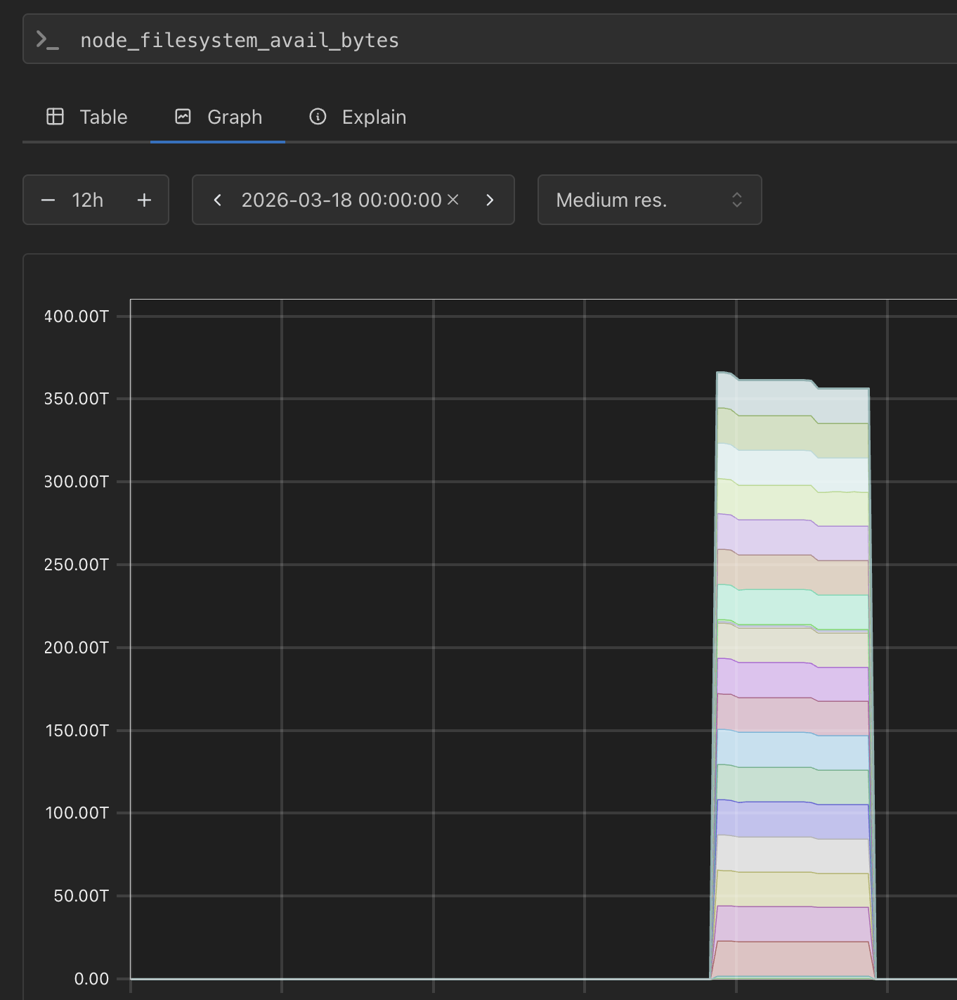

13. Открыл Grafana и проверил отображение графиков

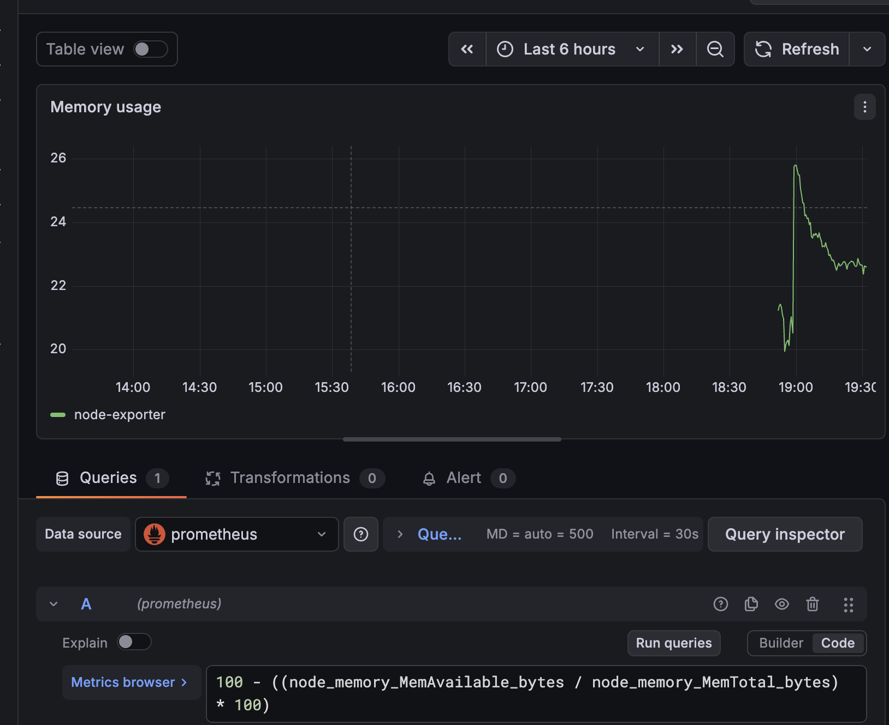

14. Создал несколько графиков для разных метрик

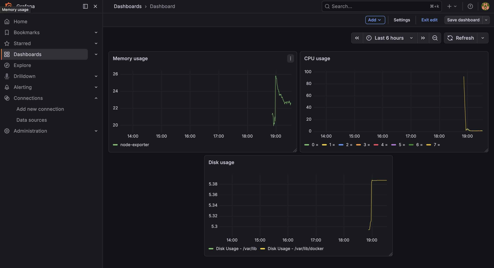