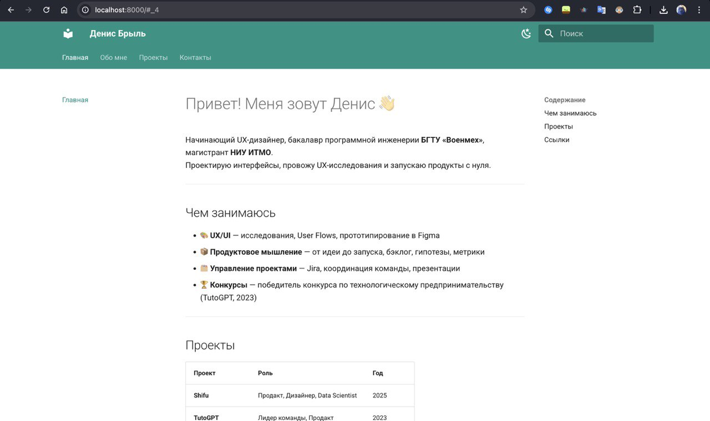
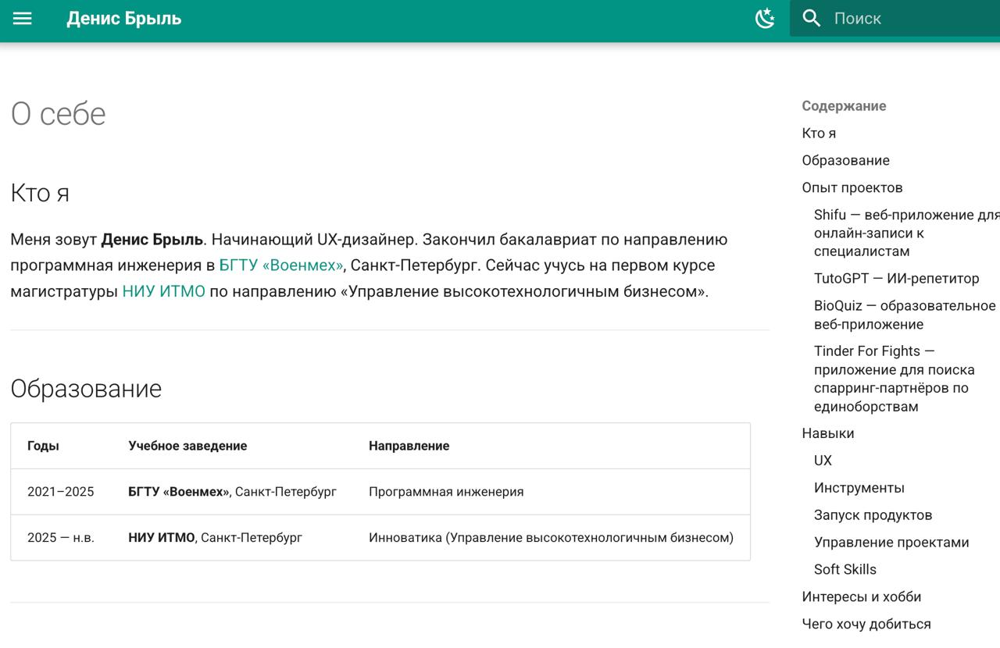
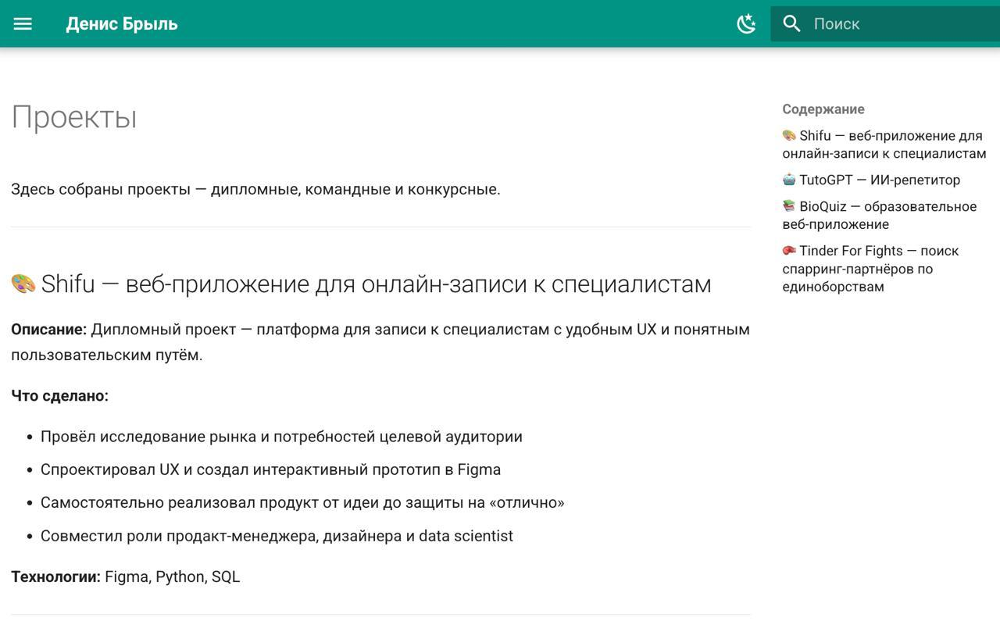
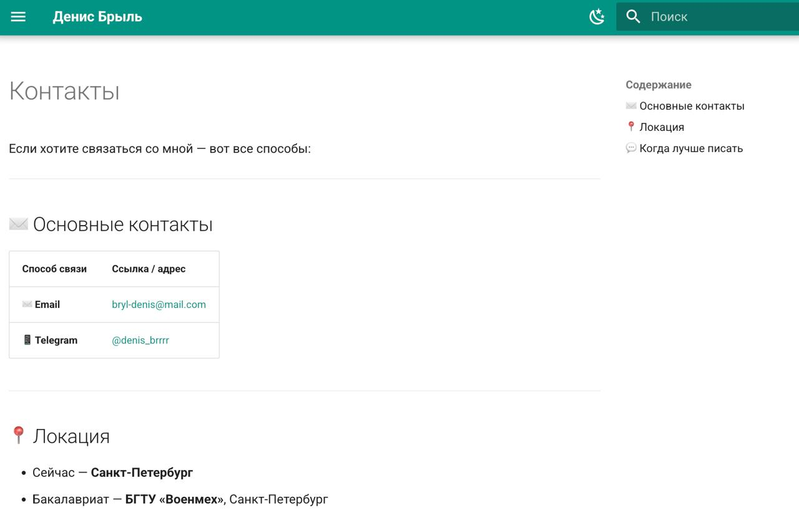

## Personal Site — Denis Bryl

University: [ITMO University](https://itmo.ru/)
Course: [Введение в веб технологии](https://itmo-ict-faculty.github.io/introduction-in-web-tech/)
Year: 2025/2026
Author: Denis Bryl
Lab: Курсовая работа
Date of create: 17.03.2026

---

### Курсовая работа. Создание персонального сайта с использованием MkDocs

#### Описание

Собрал персональный сайт на MkDocs с темой Material: обо мне, проектах и контактах.  
Сайт разворачивается локально и может быть выложен на GitHub Pages.

#### Структура проекта

- `personal-site/mkdocs.yml` — конфигурация MkDocs и темы Material  
- `personal-site/docs/index.md` — главная страница  
- `personal-site/docs/about.md` — страница «О себе»  
- `personal-site/docs/projects.md` — страница «Проекты»  
- `personal-site/docs/contacts.md` — страница «Контакты»

#### Ход работы

1. **Подготовка и установка**

   - Проверил Python и pip:

     ```bash
     python3 --version
     pip3 --version
     ```

   - Установил MkDocs и тему Material:

     ```bash
     pip3 install mkdocs mkdocs-material
     mkdocs --version
     ```

2. **Создание и настройка проекта**

   - Создал каталог и базовый проект:

     ```bash
     mkdir -p personal-site
     cd personal-site
     mkdocs new .
     ```

   - Настроил `mkdocs.yml`:
     - `site_name`, `site_description`, `site_author`
     - тему `material`, язык `ru`
     - палитру и переключатель тёмной/светлой темы
     - навигацию: Главная, О себе, Проекты, Контакты
     - social‑иконки GitHub и Telegram

3. **Создал контент страниц**

   - **Главная (`index.md`)** — краткое описание, чем занимаюсь, таблица проектов, ссылки.  
     Скрин:  
     

   - **О себе (`about.md`)** — образование (БГТУ «Военмех», НИУ ИТМО), опыт проектов (Shifu, TutoGPT, BioQuiz, Tinder For Fights), навыки и хобби, блок «Чего хочу добиться» с фокусом на UX-дизайн.  
     Скрин:  
     

   - **Проекты (`projects.md`)** — 4 проекта: Shifu (дипломный), TutoGPT (победитель конкурса), BioQuiz, Tinder For Fights.  
     Скрин:  
     

   - **Контакты (`contacts.md`)** — таблица с email и Telegram, блок с локацией (Санкт-Петербург) и подсказкой, когда лучше писать.  
     Скрин:  
     

4. **Сборка и запуск**

   - Локальное тестирование:

     ```bash
     cd personal-site
     mkdocs serve
     ```

     Сайт открывается по адресу `http://127.0.0.1:8000/personal-site/`.

   - Сборка статики:

     ```bash
     mkdocs build
     ```

     Статические файлы попадают в папку `site/`.

#### Результаты курсовой работы

- Рабочий сайт на MkDocs + Material с 4 разделами (главная, о себе, проекты, контакты);
- Настроенная навигация, тёмная/светлая тема, поиск;
- Структурированный контент на Markdown (заголовки, списки, таблицы, эмодзи);
- Сайт собирается локально и готов к публикации на GitHub Pages.
